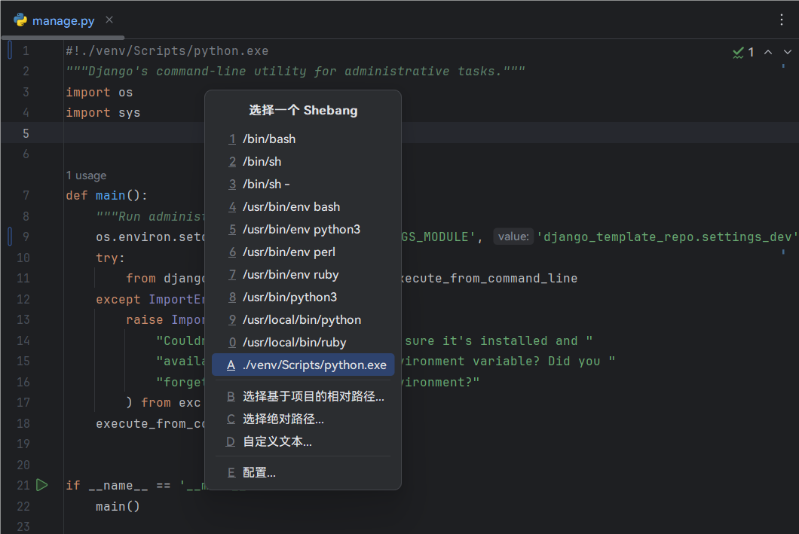

# HooTool - Shebang

[中文](./README.md)／[English](./README_EN.md)／...

一个基于 IntelliJ IDE 的插件，可以很方便地在文件头部插入预置的 Shebang。

## 兼容性

- 基于 IntelliJ 的 IDE（2022.2 ~ 2024.1 版本）
- DevEco Studio NEXT Developer Beta1

未对其它平台进行测试。

## 用法

在文件头部插入 Shebang：

- 菜单：代码 → 生成... → Shebang

配置预设的 Shebang 列表：

- 菜单：文件 → 设置... → 工具 → Shebang

## 反馈

- [GitHub issue](https://github.com/aixcyi/intellij-shebang/issues)
- QQ群 [418751161](https://qm.qq.com/q/ou4RdUFMTm)
