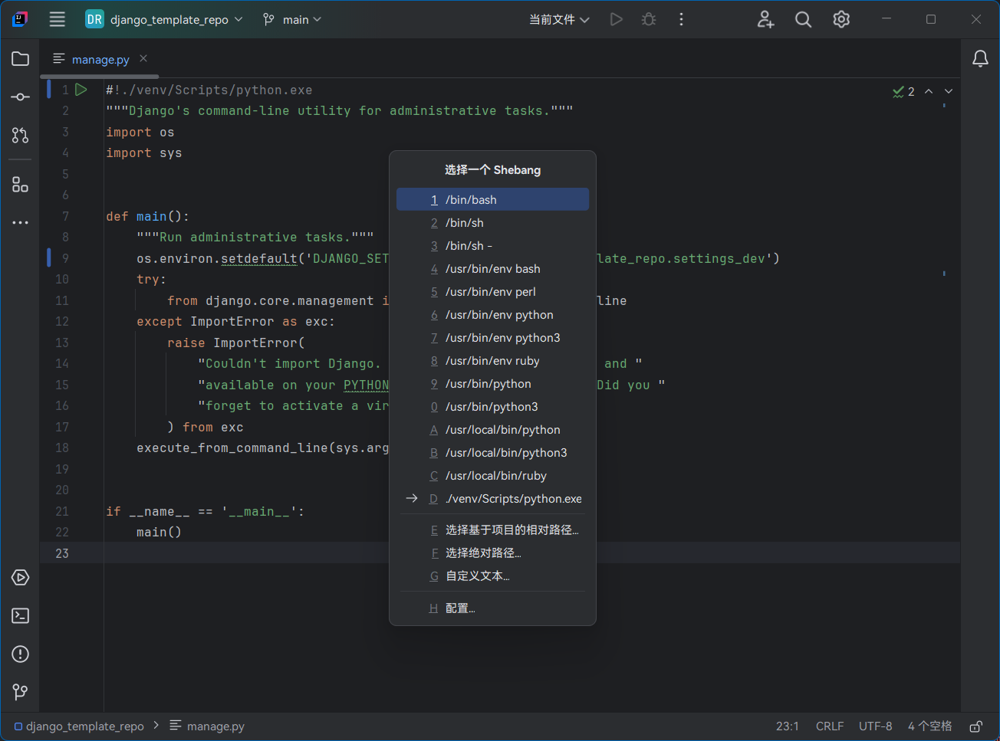

# HooTool - Shebang

[简体中文](./README.md)／[English](./README_EN.md)／...

一个基于 IntelliJ IDE 的插件，提供了预置 [Shebang](https://www.runoob.com/linux/linux-shell.html) 的插入和管理。

> shebang 也叫 hashbang、sharp-exclamation、sha-bang、pound-bang、hash-pling 。

## 功能

- 在文件头部插入预设的 Shebang，菜单：代码 → 生成... → Shebang...
- 配置预设的 Shebang 列表，菜单：文件 → 设置... → 工具 → Shebang

## 兼容性

- 基于 IntelliJ 的 IDE（详见[插件市场](https://plugins.jetbrains.com/plugin/24907-hootool--shebang/versions)），包括社区版及专业版
- DevEco Studio NEXT Developer Beta1
- _未对其它平台进行测试_

## 链接

- [插件市场](https://plugins.jetbrains.com/plugin/24907-hootool--shebang/)
- [问题与反馈（GitHub）](https://github.com/aixcyi/intellij-shebang/issues/)
- [问题与反馈（码云）](https://github.com/aixcyi/intellij-shebang/issues/)
- [QQ群 418751161](https://qm.qq.com/q/ou4RdUFMTm)
