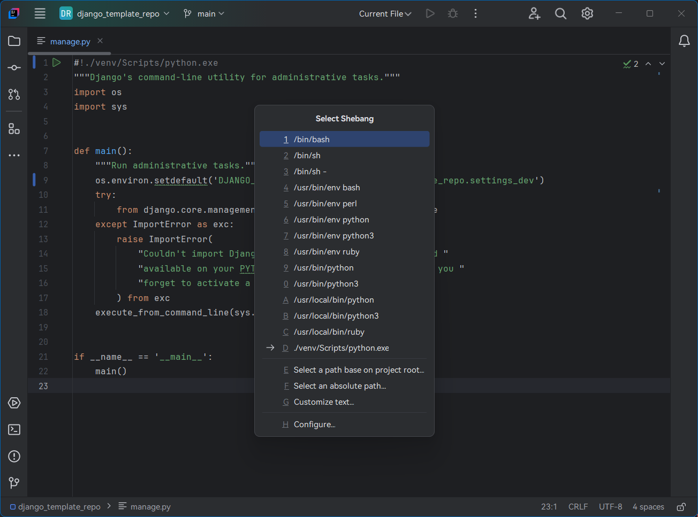

# HooTool - Shebang

[简体中文](./README.md)／[English](./README_EN.md)／...

An IntelliJ-based IDE plugin, provides [Shebang](https://en.wikipedia.org/wiki/Shebang_(Unix)) insertion and management.

> Shebang, also called hashbang, sharp-exclamation, sha-bang, pound-bang, or hash-pling.

## Features

- Insert a preset Shebang into file head, menu: _Code_ → _Generate..._ → _Shebang..._
- Configure preset Shebangs, menu: _File_ → _Settings..._ → _Tools_ → _Shebang_

## Compatibility

- IntelliJ-based IDE 2022.2+, both Community and Professional Edition,
  see [Marketplace](https://plugins.jetbrains.com/plugin/24907-hootool--shebang/versions) for detail
  - 2.x+ required 2022.3+
  - [1.x](.//blob/1.x/README.md) required 2022.2+
- DevEco Studio NEXT Developer Beta1
- _Not tested on other platforms_

## Links

- [JetBrains Marketplace](https://plugins.jetbrains.com/plugin/24907-hootool--shebang/)
- [Main Issue Tracker](https://github.com/aixcyi/intellij-shebang/issues/)
- [Secondary Issue Tracker](https://gitee.com/aixcyi/intellij-shebang/issues/)
