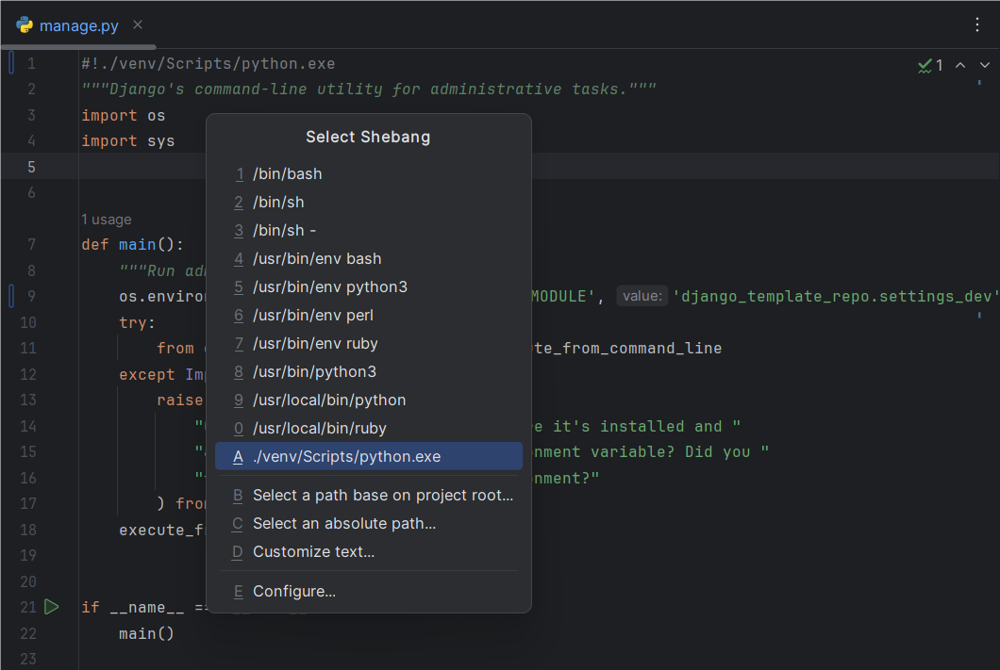

# HooTool - Shebang

[中文](./README.md)／[English](./README_EN.md)／...

An IntelliJ-based IDE plugin, allow you insert a preset Shebang into file head quickly.

## Compatibility

- IntelliJ-based IDE version from 2022.2 to 2024.1
- DevEco Studio NEXT Developer Beta1

_Not tested on other platforms._

## Usage

Insert a Shebang into file head:

- Menu: Code → Generate... → Shebang

Configure all preset Shebangs:

- Menu: File → Settings... → Tools → Shebang

## Bug Tracking

- [GitHub issue](https://github.com/aixcyi/intellij-shebang/issues)
